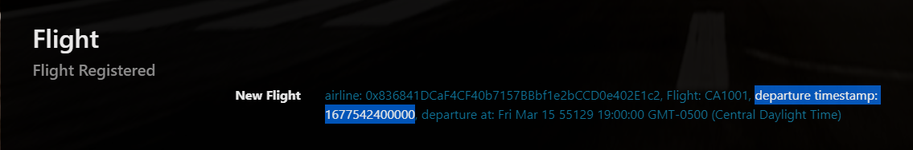
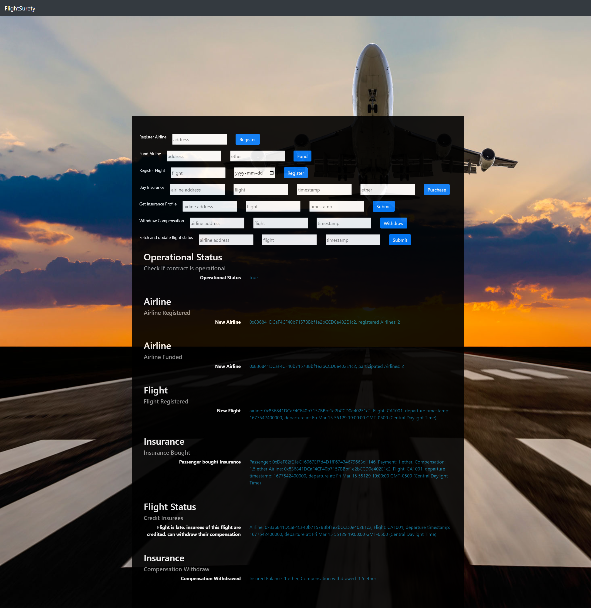

# Instructions
## Environment
- truffle version
    ```
    Truffle v5.7.4 (core: 5.7.4)
    Ganache v7.7.3
    Solidity - ^0.4.24 (solc-js)
    Node v16.19.0
    Web3.js v1.8.1
    ```
- Ganache UI version: `v2.5.4`
- Solidity compiler version: `0.4.25`

## Install
- `npm install`

## Setup
1. create two workspaces in `Ganache` with following settings
    
    - Name one of workspace as "Development"
    - Name another workspace as "Testing"
    - ACCOUNT DEFAULT BALANCE = 1000
    - TOTAL ACCOUNTS TO GENERATE = 30
2. copy "Development" workspace's MNEMONIC, go to `./truffle-config.js`
    ```
    change - var mnemonic = "[Development workspace's MNEMONIC]";
    ```
## Test
1. Switch to the "Testing" Ganache workspace
2. go to `./config/testConfig.js`
    ```
    on line 10:
    change testAddresses to the first 11 account's address in Ganache workspace
    ```
3. run test `truffle test --network test`

## To use the Dapp

1. Switch to the "Development" Ganache workspace
2. In `./migrations/2_deploy_contracts.js`:

    ```
    change:
    let firstAirline = '[first account's address (address of index 0) in Ganache workspace]';
    ```
3. In `./src/server/server.js`
    ```
    change line 20:
    from: '[first account's address (address of index 0) in Ganache workspace]', // contract owner address
    ```
4. run commands in terminal to deploy contract
    ```
    truffle compile
    truffle migrate --reset --network development
    ```
5. start server: `npm run server`

    - In order to forcefully trigger a late flight, go to `./src/server/server.js`
        ```
        on line 83: comment line 83, uncomment line 85

        // const randomStatusCode = getRandomStatusCode();
        // uncomment to force trigger a late flight
        const randomStatusCode = 20;
        ```

6. start dapp: `npm run dapp`

7. In your web browser, go to: http://localhost:8000

### Follow these steps to experience the Dapp
1. In Metamask, copy `Airline2's account address`, then switch to account `Airline1` 

2. Paste `Airline2's account address` to `Register Airline input`, click `Register Button`, wait for transaction to complete, then Display Container below will update

3. In Metamask, switch to account Airline2

4. Paste Airline2's account address to Register Airline input, enter `10` in the `ether input`, click `Fund button`, wait for transaction to complete, then Display Container below will update

5. Make sure your Metamask account is `Airline2`, enter flight name and choose a `date (choose tomorrow's date)` to register a flight

6. Switch Metamask account to `passenger`, enter airline address, flight, `timestamp (timestamp can be copied from Flight Registered Display)` and `1 ether` to buy insurance
    
    

7. Make sure your Metamask account is `passenger`, enter airline address, flight, `timestamp (timestamp can be copied from Flight Registered Display)` to get passenger's insurance profile.

8. To fetch and update flight status, enter airline address, flight, `timestamp (timestamp can be copied from Flight Registered Display)` and click `Submit`
    
    - flight status logs can be checked in server's terminal
    - if late flight event not emitted, try forcefully trigger a late flight

9. After a `late flight event` occurs, make sure your Metamask account is `passenger`, enter airline address, flight, `timestamp (timestamp can be copied from Flight Registered Display)` and click `Withdraw` to withdraw passenger's compensation.


# Dapp Result Screenshot

#

# FlightSurety

FlightSurety is a sample application project for Udacity's Blockchain course.

## Install

This repository contains Smart Contract code in Solidity (using Truffle), tests (also using Truffle), dApp scaffolding (using HTML, CSS and JS) and server app scaffolding.

To install, download or clone the repo, then:

`npm install`
`truffle compile`

## Develop Client

To run truffle tests:

`truffle test ./test/flightSurety.js`
`truffle test ./test/oracles.js`

To use the dapp:

`truffle migrate`
`npm run dapp`

To view dapp:

`http://localhost:8000`

## Develop Server

`npm run server`
`truffle test ./test/oracles.js`

## Deploy

To build dapp for prod:
`npm run dapp:prod`

Deploy the contents of the ./dapp folder


## Resources

* [How does Ethereum work anyway?](https://medium.com/@preethikasireddy/how-does-ethereum-work-anyway-22d1df506369)
* [BIP39 Mnemonic Generator](https://iancoleman.io/bip39/)
* [Truffle Framework](http://truffleframework.com/)
* [Ganache Local Blockchain](http://truffleframework.com/ganache/)
* [Remix Solidity IDE](https://remix.ethereum.org/)
* [Solidity Language Reference](http://solidity.readthedocs.io/en/v0.4.24/)
* [Ethereum Blockchain Explorer](https://etherscan.io/)
* [Web3Js Reference](https://github.com/ethereum/wiki/wiki/JavaScript-API)